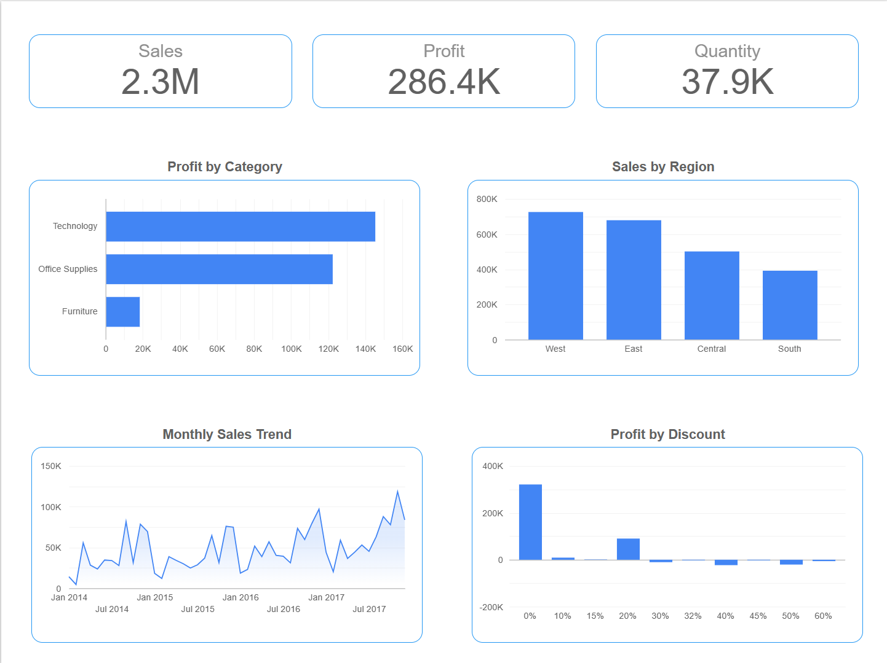
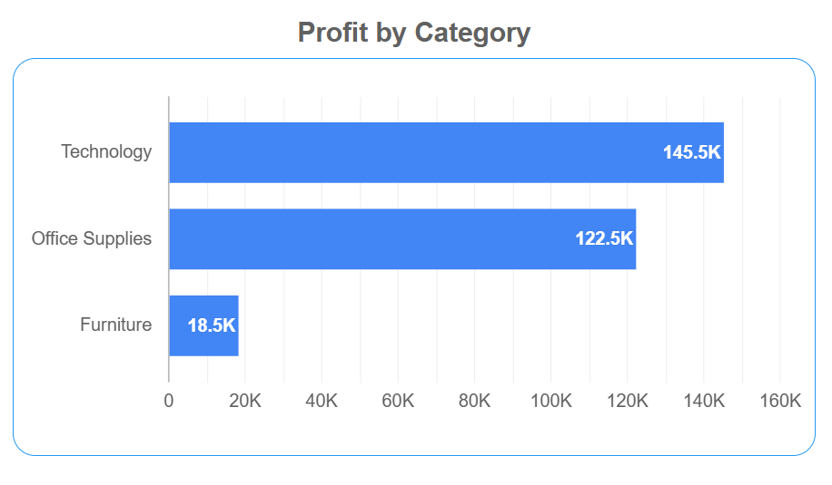
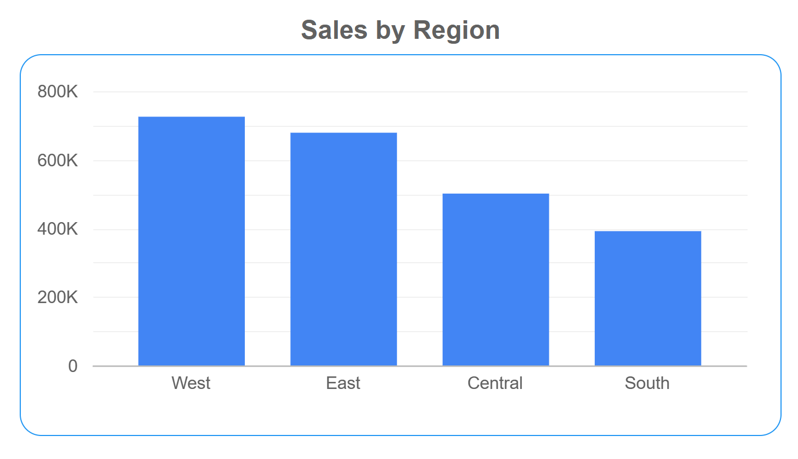
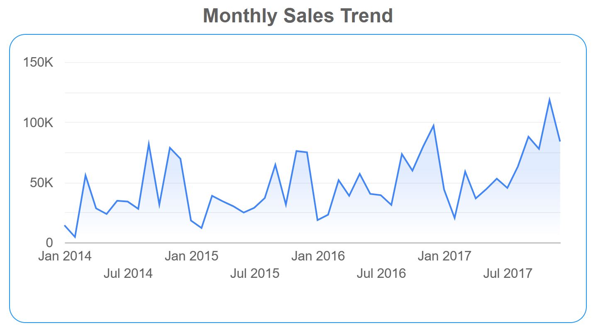
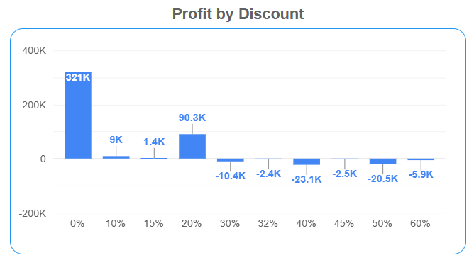

# 🛒 Superstore Sales Analysis

## 📌 Project Overview
Analysis of a retail superstore's sales data to uncover 
insights about profitability, regional performance, 
discount impact, and sales trends.

## 🎯 Business Questions Answered
1. Which product category generates the most profit?
2. Which region has the highest sales?
3. Do discounts hurt profitability?
4. What are the monthly sales trends?

## 🛠️ Tools Used
- Microsoft Excel — Data cleaning & Pivot Tables
- Google Looker Studio — Interactive Dashboard

## 📊 Dataset
- Source: Kaggle — Sample Superstore Dataset
- Records: 9,994 orders
- Period: 2014 - 2017

## 🔍 Key Insights
- **Technology** is the most profitable category ($145K profit)
- **West region** leads in sales ($725K)
- Discounts above **20% cause losses** consistently
- Sales show **year-over-year growth** with Q4 seasonal peaks

## 📈 Dashboard
[Link to Live Google Studio Dashboard](https://datastudio.google.com/reporting/7c2894d3-266e-4935-85a1-f43ed31c4699)

### Profit by Category

### Sales by Region

### Monthly Sales Trend

### Profit by Discount

